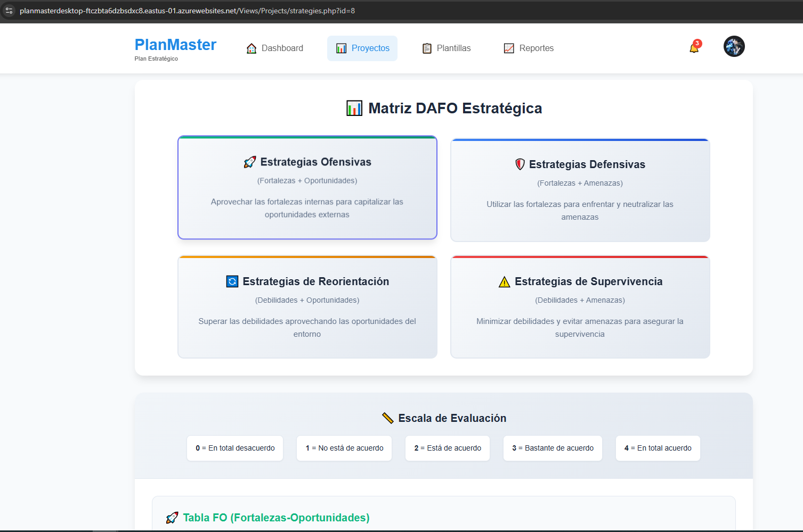
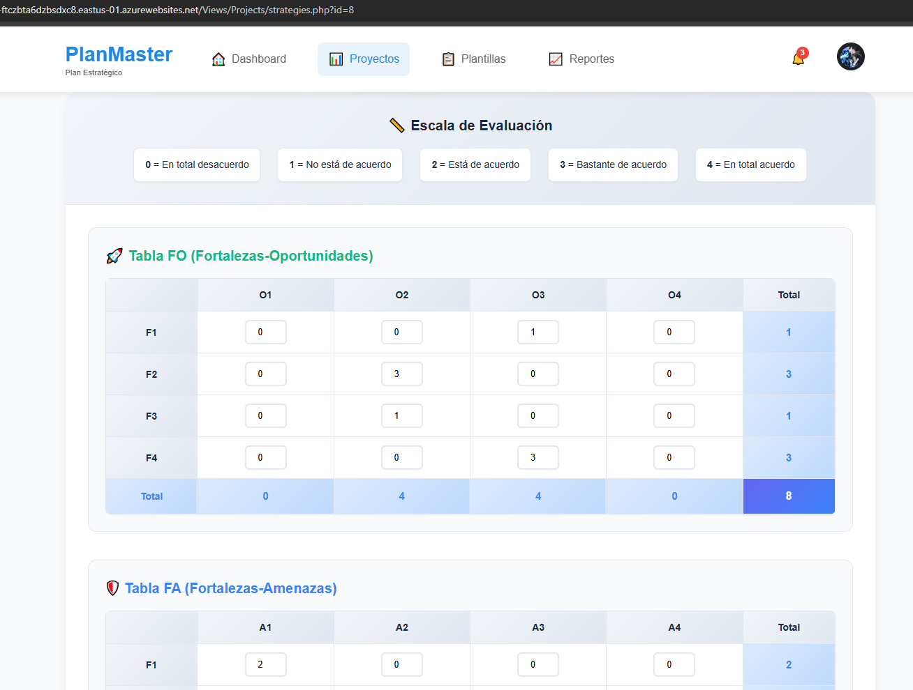
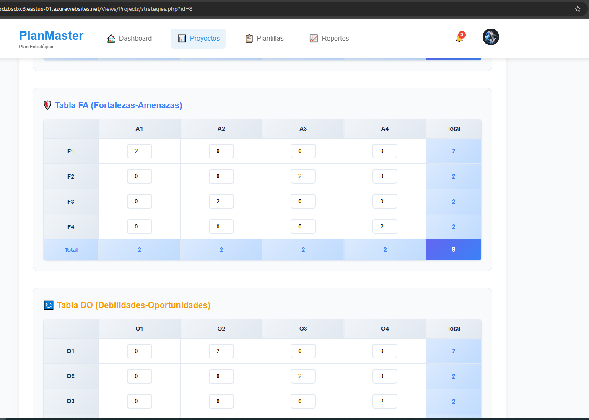
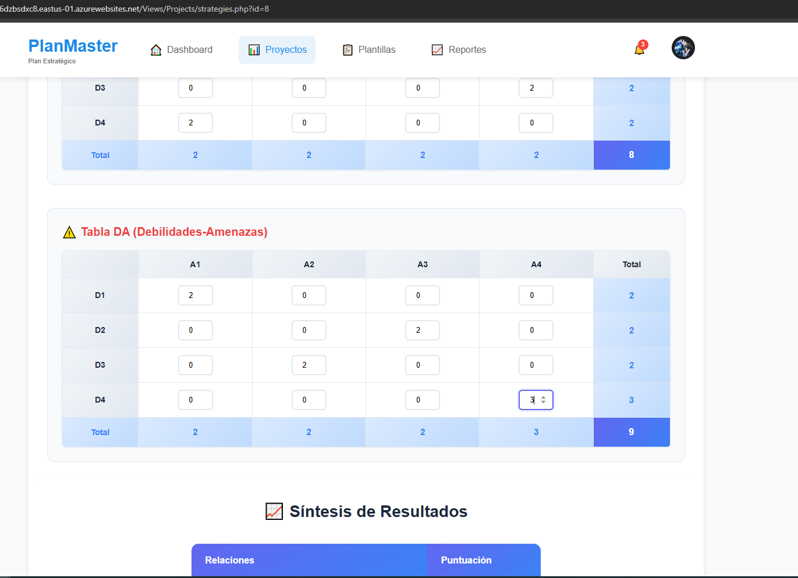
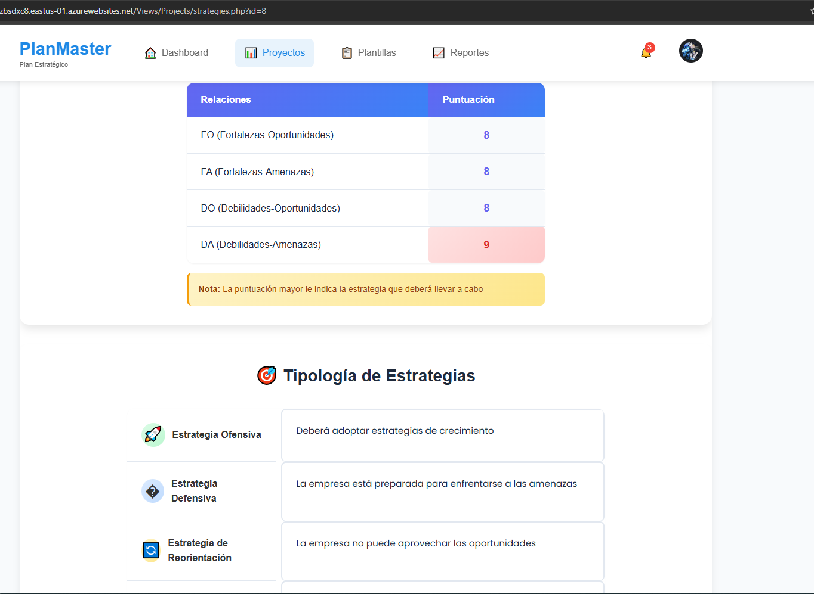

# Examen Práctica Unidad II - PETI

**Alumno:** Gabriela Luzkalid Gutierrez Mamani 
**Fecha:** 22 de octubre de 2025  
**Repositorio GitHub:** 
- https://github.com/LuzkalidGM/PE_II_EXAMEN_PRACTICO.git (LOCAL)

- https://github.com/UPT-FAING-EPIS/PlanMaster (DESPLEGADO)

## Descripción del Sistema

PlanMaster es un sistema web desarrollado en PHP para la gestión y análisis estratégico empresarial. El sistema permite realizar análisis DAFO (SWOT), identificación de estrategias y planificación empresarial de manera integral.

### Arquitectura del Sistema

El sistema está construido utilizando la arquitectura MVC (Modelo-Vista-Controlador) con PHP nativo y cuenta con la siguiente estructura:

- **Modelos:** Gestión de datos empresariales (`Models/`)
- **Controladores:** Lógica de negocio (`Controllers/`)
- **Vistas:** Interfaz de usuario (`Views/`)
- **Base de Datos:** MySQL con configuración dual ([`config/database.php`](config/database.php))

### Configuración de Base de Datos

La clase [`Database`](config/database.php) implementa un sistema de configuración dual que detecta automáticamente el entorno:

```php
// Configuración automática de entorno
if (isset($_ENV['MYSQL_HOST']) || getenv('MYSQL_HOST')) {
    // Configuración de producción (Railway)
    $this->host = $_ENV['MYSQL_HOST'] ?? getenv('MYSQL_HOST');
    $this->db_name = $_ENV['MYSQL_DATABASE'] ?? getenv('MYSQL_DATABASE');
    $this->username = $_ENV['MYSQL_USER'] ?? getenv('MYSQL_USER');
    $this->password = $_ENV['MYSQL_PASSWORD'] ?? getenv('MYSQL_PASSWORD');
    $this->port = $_ENV['MYSQL_PORT'] ?? getenv('MYSQL_PORT') ?? 3306;
} else {
    // Configuración local
    $this->host = "localhost";
    $this->db_name = "planmaster";
    $this->username = "root";
    $this->password = "";
    $this->port = 3306;
}
```

---

## 10. IDENTIFICACIÓN DE ESTRATEGIAS

### Análisis DAFO - Matriz de Estrategias Empresariales

La identificación de estrategias se basa en el cruce sistemático entre factores internos (fortalezas y debilidades) y factores externos (oportunidades y amenazas).

### Matriz DAFO Visual

```
┌─────────────────────┬─────────────────────┐
│    ESTRATEGIAS      │    ESTRATEGIAS      │
│     OFENSIVAS       │     DEFENSIVAS      │
│  (Fortalezas +      │   (Fortalezas +     │
│  Oportunidades)     │    Amenazas)        │
├─────────────────────┼─────────────────────┤
│    ESTRATEGIAS      │    ESTRATEGIAS      │
│  DE REORIENTACIÓN   │  DE SUPERVIVENCIA   │
│  (Debilidades +     │  (Debilidades +     │
│  Oportunidades)     │    Amenazas)        │
└─────────────────────┴─────────────────────┘
```

### Tablas de Evaluación Estratégica

#### Tabla FO (Fortalezas-Oportunidades)
| F/O | O1 | O2 | O3 | O4 | Total |
|-----|----|----|----|----|-------|
| F1  | 0  | 0  | 0  | 0  | 0     |
| F2  | 0  | 0  | 0  | 0  | 0     |
| F3  | 0  | 0  | 0  | 0  | 0     |
| F4  | 0  | 0  | 0  | 0  | 0     |
|Total| 0  | 0  | 0  | 0  | 0     |

#### Tabla FA (Fortalezas-Amenazas)
| F/A | A1 | A2 | A3 | A4 | Total |
|-----|----|----|----|----|-------|
| F1  | 0  | 0  | 0  | 0  | 0     |
| F2  | 0  | 0  | 0  | 0  | 0     |
| F3  | 0  | 0  | 0  | 0  | 0     |
| F4  | 0  | 0  | 0  | 0  | 0     |
|Total| 0  | 0  | 0  | 0  | 0     |

#### Tabla DO (Debilidades-Oportunidades)
| D/O | O1 | O2 | O3 | O4 | Total |
|-----|----|----|----|----|-------|
| D1  | 0  | 0  | 0  | 0  | 0     |
| D2  | 0  | 0  | 0  | 0  | 0     |
| D3  | 0  | 0  | 0  | 0  | 0     |
| D4  | 0  | 0  | 0  | 0  | 0     |
|Total| 0  | 0  | 0  | 0  | 0     |

#### Tabla DA (Debilidades-Amenazas)
| D/A | A1 | A2 | A3 | A4 | Total |
|-----|----|----|----|----|-------|
| D1  | 0  | 0  | 0  | 0  | 0     |
| D2  | 0  | 0  | 0  | 0  | 0     |
| D3  | 0  | 0  | 0  | 0  | 0     |
| D4  | 0  | 0  | 0  | 0  | 0     |
|Total| 0  | 0  | 0  | 0  | 0     |

**Escala de Valoración:**
- 0 = En total desacuerdo
- 1 = No está de acuerdo  
- 2 = Está de acuerdo
- 3 = Bastante de acuerdo
- 4 = En total acuerdo

### Síntesis de Resultados

| Relaciones | Puntuación |
|------------|------------|
| FO         | 0          |
| AF         | 0          |
| AD         | 0          |
| OD         | 0          |

> **Nota:** La puntuación mayor indica la estrategia que deberá llevar a cabo

### Tipología de Estrategias

| Tipo de Estrategia | Descripción |
|-------------------|-------------|
| **Estrategia Ofensiva** | Deberá adoptar estrategias de crecimiento |
| **Estrategia Defensiva** | La empresa está preparada para enfrentarse a las amenazas |
| **Estrategia de Supervivencia** | Se enfrenta a amenazas externas sin las fortalezas necesarias |
| **Estrategia de Reorientación** | La empresa no puede aprovechar las oportunidades |

---


## Capturas del Sistema

### Imagen 1 - Identificación de Estrategias Sistema


### Imagen 2 - Identificación de Estrategias



### Imagen 3 - Identificación de Estrategias



### Imagen 4 - Identificación de Estrategias



### Imagen 5 - Identificación de Estrategias



### Imagen 6 - Identificación de Estrategias



---

## Mejoras Implementadas

### 1. Sistema de Configuración Dual
- **Descripción:** Implementación de detección automática de entorno (local/producción)
- **Archivo modificado:** [`config/database.php`](config/database.php)
- **Beneficio:** Facilita el despliegue sin modificar configuraciones

```php
// Verificación automática de entorno
if (isset($_ENV['MYSQL_HOST']) || getenv('MYSQL_HOST')) {
    // Configuración de Railway (producción)
} else {
    // Configuración local
}
```

### 2. Gestión Robusta de Conexiones
- **Descripción:** Manejo mejorado de errores y excepciones en conexiones MySQL
- **Características:**
  - Verificación automática de conexión con `connect_error`
  - Configuración de charset UTF-8
  - Método de cierre seguro de conexiones
  - Manejo de excepciones con try-catch

### 3. Arquitectura MVC Estructurada
- **Descripción:** Organización clara de componentes del sistema
- **Estructura:**
  - Modelos de datos especializados
  - Controladores de lógica de negocio
  - Vistas organizadas por funcionalidad

### 4. Interface de Usuario Mejorada
- **Descripción:** Diseño responsive y intuitivo
- **Características:**
  - Navegación fluida entre módulos
  - Tablas interactivas de evaluación
  - Visualización clara de matrices estratégicas

---

## Tecnologías Utilizadas

- **Backend:** PHP 7.4+
- **Base de Datos:** MySQL/MariaDB
- **Frontend:** HTML5, CSS3, JavaScript
- **Arquitectura:** MVC Pattern
- **Despliegue:** Railway (Producción), XAMPP/LAMP (Local)

## Instalación y Configuración

1. Clonar el repositorio
```bash
git clone [URL-del-repositorio]
```

2. Configurar base de datos local o variables de entorno
```bash
# Para producción, configurar variables de entorno:
MYSQL_HOST=tu-host
MYSQL_DATABASE=planmaster
MYSQL_USER=tu-usuario
MYSQL_PASSWORD=tu-password
MYSQL_PORT=3306
```

3. Importar esquemas SQL desde [`db/`](db/)
4. Configurar servidor web (Apache/Nginx)
5. Acceder al sistema través del navegador

## Estructura del Proyecto

```
PE_II_EXAMEN_PRACTICO/
├── config/
│   └── database.php          # Configuración de BD dual
├── Controllers/              # Controladores MVC
├── Models/                   # Modelos de datos
├── Views/                    # Vistas del sistema
├── db/                       # Scripts SQL
├── imagenes/                 # Capturas del sistema
└── README.md                 # Este archivo
```