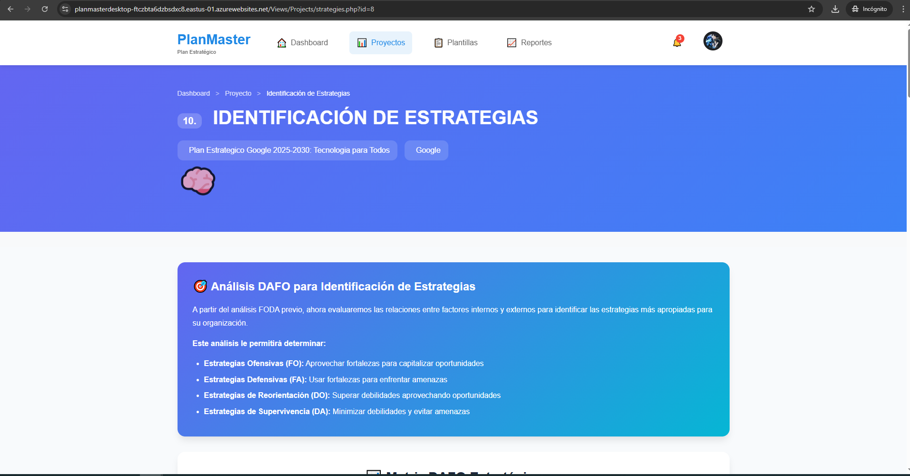

# Examen Práctica Unidad II - PETI

**Alumno:** Gabriela Luzkalid Gutierrez Mamani 
**Fecha:** 22 de octubre de 2025  
**Repositorio GitHub:** 
- https://github.com/LuzkalidGM/PE_II_EXAMEN_PRACTICO.git (LOCAL)

- https://github.com/UPT-FAING-EPIS/PlanMaster (DESPLEGADO)

---


## Capturas del Sistema

### Imagen 1 - Identificación de Estrategias Sistema



### Imagen 2 - Identificación de Estrategias


### Imagen 3 - Identificación de Estrategias


### Imagen 4 - Identificación de Estrategias


### Imagen 5 - Identificación de Estrategias


### Imagen 6 - Identificación de Estrategias


---

## Mejoras Implementadas

### 1. Sistema de Configuración Dual
- **Descripción:** Implementación de detección automática de entorno (local/producción)
- **Archivo modificado:** [`config/database.php`](config/database.php)
- **Beneficio:** Facilita el despliegue sin modificar configuraciones

```php
// Verificación automática de entorno
if (isset($_ENV['MYSQL_HOST']) || getenv('MYSQL_HOST')) {
    // Configuración de Railway (producción)
} else {
    // Configuración local
}
```

### 2. Gestión Robusta de Conexiones
- **Descripción:** Manejo mejorado de errores y excepciones en conexiones MySQL
- **Características:**
  - Verificación automática de conexión con `connect_error`
  - Configuración de charset UTF-8
  - Método de cierre seguro de conexiones
  - Manejo de excepciones con try-catch

### 3. Arquitectura MVC Estructurada
- **Descripción:** Organización clara de componentes del sistema
- **Estructura:**
  - Modelos de datos especializados
  - Controladores de lógica de negocio
  - Vistas organizadas por funcionalidad

### 4. Interface de Usuario Mejorada
- **Descripción:** Diseño responsive y intuitivo
- **Características:**
  - Navegación fluida entre módulos
  - Tablas interactivas de evaluación
  - Visualización clara de matrices estratégicas

---

## Tecnologías Utilizadas

- **Backend:** PHP 7.4+
- **Base de Datos:** MySQL/MariaDB
- **Frontend:** HTML5, CSS3, JavaScript
- **Arquitectura:** MVC Pattern
- **Despliegue:** Railway (Producción), XAMPP/LAMP (Local)

## Instalación y Configuración

1. Clonar el repositorio
```bash
git clone [URL-del-repositorio]
```

2. Configurar base de datos local o variables de entorno
```bash
# Para producción, configurar variables de entorno:
MYSQL_HOST=tu-host
MYSQL_DATABASE=planmaster
MYSQL_USER=tu-usuario
MYSQL_PASSWORD=tu-password
MYSQL_PORT=3306
```

3. Importar esquemas SQL desde [`db/`](db/)
4. Configurar servidor web (Apache/Nginx)
5. Acceder al sistema través del navegador

## Estructura del Proyecto

```
PE_II_EXAMEN_PRACTICO/
├── config/
│   └── database.php          # Configuración de BD dual
├── Controllers/              # Controladores MVC
├── Models/                   # Modelos de datos
├── Views/                    # Vistas del sistema
├── db/                       # Scripts SQL
├── imagenes/                 # Capturas del sistema
└── README.md                 # Este archivo
```